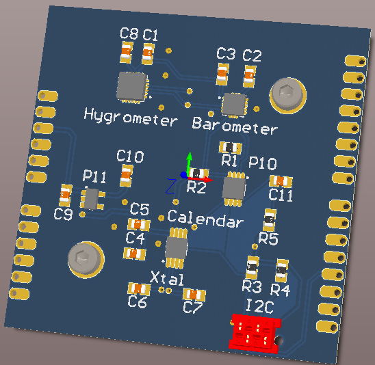

# Meteo board

## Introduction

As the name says, this is a board used to collect atmospheric informations. Moreover, it provides a real time calendar. Applications vary from data logging, classical meteo station design and alarm clock

### Characteristics

The board is still in development. This is the second hardware revision, a clock quartz has been added along with sensors that can be (potentially) hand soldered.

## Assembly

The board is still in development. For the moment refer to the altium schematics. Even if the board can be soldered by hand, using a reflow oven is recomennded

## Programming

The firmware is still in development. Nevertheless functions to read the sensors in an Arduino environment are already existing

## Licence

This board is published under [Creative Commons Attribution Share-Alike license](http://creativecommons.org/licenses/by-sa/3.0/).

